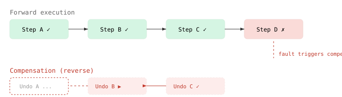
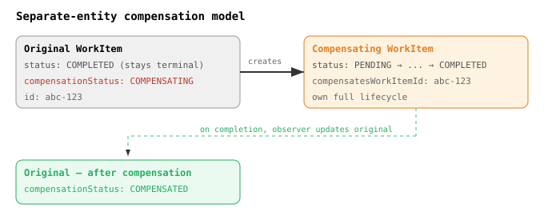
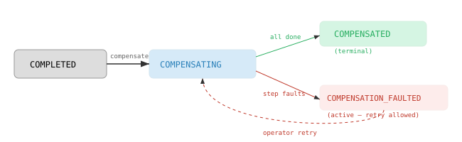

# When Done Isn't Done — Designing Saga Compensation for CaseHub

A WorkItem marked COMPLETED should be done. That's the contract — seven terminal states, all final, no coming back. Every consumer in the platform relies on it: filter engines remove terminal items from queues, the engine marks PlanItems as finished, observers stop watching, dashboards close the card.

Except sometimes done work needs to be undone.

A clinical trial IRB approval gets reversed when the protocol is withdrawn. A financial decision gets unwound when fraud is detected downstream. A multi-step onboarding process needs to roll back step 7 because step 3's KYC check came back invalid after the fact. In regulated domains — EU AI Act Art.12, GDPR Art.17/22 — compensation isn't optional. The audit trail must capture both the original action and its structured reversal as immutable, causally-linked entries.

CaseHub had no model for this. The workarounds were ugly: create a manual WorkItem to undo previous work (no causal link), cancel the case (wrong semantics — stopping isn't compensating), or leave completed steps as-is and note the failure in the audit trail (inconsistent domain state). This is the Saga pattern gap.

## What a saga actually is

The term gets thrown around loosely. A saga is a specific thing: a sequence of local transactions where each step has a corresponding compensating transaction. If step N fails, the coordinator invokes compensation for steps N-1, N-2, ..., 1.



Key properties: each step declares its compensating action upfront. Compensation runs in reverse order. It's idempotent. And it can fail — which is its own problem.

BPMN 2.0 handles this with first-class compensation events: a completed activity can have a compensation boundary event that fires when a compensate event is thrown. The activity enters COMPENSATING, then COMPENSATED. Clean, well-specified, twenty years of production use behind it.

## The terminal invariant problem

CaseHub's WorkItemStatus has twelve values. Seven are terminal. The lifecycle alignment work (issue #240) had just finished auditing every `isTerminal()` consumer across the platform to add FAULTED and OBSOLETE. That audit found six locations with hardcoded status enumeration across four modules — the same fragility pattern at every site.

So when I started thinking about compensation, the obvious BPMN-aligned approach — add COMPENSATING and COMPENSATED to WorkItemStatus, let COMPLETED transition to COMPENSATING — immediately set off alarms. It would break the terminal invariant that the entire platform relies on. Every `isTerminal()` consumer would need re-auditing. Again.

The question became: is a compensated WorkItem the same entity in a new state, or is it new work?

## Compensation is new work

I think it's new work. Here's why.

A WorkItem represents a unit of work requiring human attention. When that work is completed, it's done — the human made their judgment, the decision is recorded. Compensation doesn't undo the judgment; it creates a new task asking someone (often the same person, sometimes a senior reviewer) to reverse the prior decision.

The ledger already models this correctly. `LedgerEntry` has `causedByEntryId` — a forward causal chain where new entries point back to what caused them. Compensation entries don't modify existing entries; they create new ones. The hash chain continues forward. The original decision remains in the tamper-evident record.

So the design: a completed WorkItem stays COMPLETED. A new compensating WorkItem is created with `compensatesWorkItemId` linking back. The original gets a denormalized `compensationStatus` field — NONE, COMPENSATING, COMPENSATED — for query convenience. The terminal invariant is preserved. The compensating WorkItem has its own full lifecycle: PENDING, claim, start, complete or fault.



## But cases ARE the thing being compensated

At the WorkItem level, separate entities make sense. At the case level, I reached a different conclusion.

A case is an orchestration. When it compensates, the case itself is the coordinator — it tracks which steps completed, fires compensating bindings in reverse order, handles failures. COMPENSATING is a phase the case goes through, not new work created alongside it.

So `CaseStatus` gains three values: COMPENSATING (active, not terminal), COMPENSATED (terminal), and COMPENSATION_FAULTED. That last one is important — it's not terminal either. It's analogous to SUSPENDED: the case needs operator attention and can be retried. Making it terminal would mean a partially-compensated case is "done" with no recovery path. Claude caught this during the decision review — I'd originally classified it as terminal, which contradicts the principle that terminal states have no outgoing transitions.



The asymmetry is deliberate. Cases are orchestrations — compensation is a phase they go through. WorkItems are work units — compensation creates new work.

## Not strict reverse — topological reverse

The original design said "strict reverse-completion order" for compensation. Step C before B before A. Claude's decision review pushed back: what about cases with parallel branches?

If steps B and C ran independently (no dependency between them), there's no ordering constraint in compensation either. Strict reverse would serialize them unnecessarily. The engine already has dependency information — Binding produces/consumes relationships, trigger conditions, the EventLog completion graph. A topological sort of the completion DAG gives the correct answer: dependent steps compensate in reverse dependency order, independent steps compensate concurrently.

For a linear chain, topological reverse IS strict reverse. For cases with parallel branches, it's more correct and faster.

## Worker-agnostic by design

CaseHub's engine is worker-agnostic. A Binding can target different worker types — JudgmentTarget (human tasks), CapabilityTarget (automated), SubCaseTarget, ExtensionTarget. Compensation follows the same principle.

Any binding can declare `compensate: <binding-name>` pointing to another binding. The compensating binding can be any worker type. A human approval can be compensated by an automated rollback. A workflow step can be compensated by a human review. The engine doesn't care — it fires the compensating binding, whatever type it is.

```yaml
casePlan:
  bindings:
    - name: irb-review
      target:
        type: judgment
        title: "IRB Protocol Review"
        scope: "casehubio/clinical/irb-review"
      compensate: irb-review-reversal

    - name: irb-review-reversal
      target:
        type: judgment
        title: "Reverse IRB Protocol Approval"
        scope: "casehubio/clinical/irb-reversal"
      compensation: true
```

Bindings marked `compensation: true` don't execute during forward flow. No PlanItems are created for them. They exist only as targets for compensation — activated on demand when the coordinator needs them.

## Where this goes

The foundation is in casehub-work: `CompensationStatus` enum, entity fields, Flyway migration, `compensate()` and `markCompensated()` service methods, a lifecycle observer that auto-marks originals when the compensating WorkItem completes, and a REST endpoint. The ledger gets a `CompensationSupplement` — a new supplement type alongside Compliance and Provenance, carrying the original entry ID, compensation reason, and regulatory basis. The engine gets the saga coordinator, CaseStatus states, and YAML schema. The bridge connects them. Qhorus notifies agents. Connectors notify the outside world.

Eight child issues, five repos, clear dependency graph. The ledger and the engine prerequisite can run in parallel. The bridge comes after the coordinator. Qhorus and connectors come last.

I'll update this entry as the implementation progresses across sessions.
